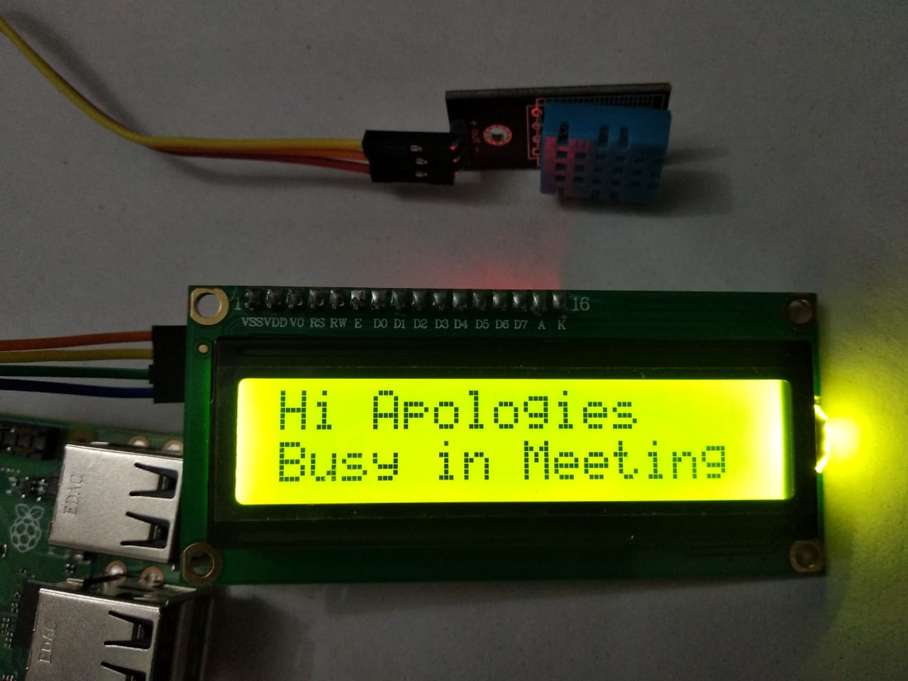

# Digitised Room An Internet of Things Project

## Tech Stack Used

### Features of Application

-   Provides Weather Information Like Temprature and Humidity from DHT11 Sensor Connected to Device here RaspberryPi

-   Availability status of Room tells visitor via LCD Screen connected to device weather person is room is busy in a another meeting or is available to meet you

### Device ,Sensor and Component Used

- Raspberry PI 3b Plus
    

- DHT 11 Sensor

    

- LCD Screen 16x2 I2C
    

- Implemented Device
    

### Project Features
- Temprature and Humidity Information
    
- Availability Status on device connected LCD
    
    

### You Can Use this Application by Follwing these steps
### `python3 digitizedRoom.py`
### `npm start`

Runs the app in the development mode.\
Open [http://localhost:3000](http://localhost:3000) to view it in the browser.

